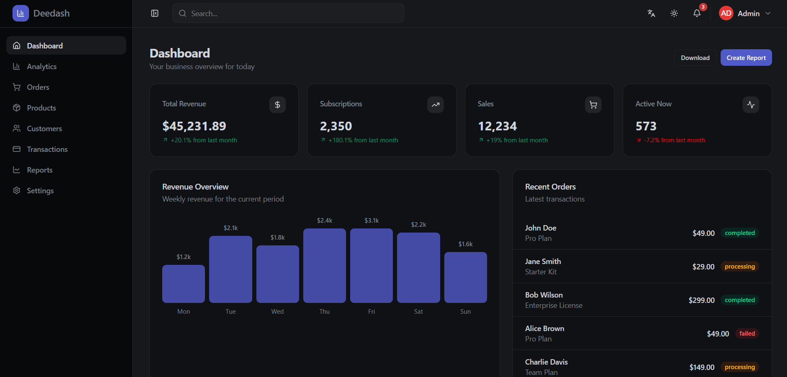

# Deedash — Dashboard Template

A modern, responsive admin dashboard built with **React**, **TypeScript**, **Vite**, and **Tailwind CSS v4** with shadcn/ui components.



## Features

- 🌗 **Dark / Light mode** — Toggle with one click, persisted to localStorage
- 🌐 **Multi-language** — English, Français, العربية (Arabic with full RTL support)
- 📱 **Responsive** — Mobile hamburger menu, collapsible sidebar
- 🎨 **Discord-inspired dark theme** — Charcoal blue palette with blurple accents

## Tech Stack

- **React 19** + TypeScript
- **Vite 8** for dev/build
- **Tailwind CSS v4** with CSS variables for theming
- **shadcn/ui** components (Radix primitives)
- **i18next** + react-i18next for translations
- **Lucide** icons

## Getting Started

```bash
npm install
npm run dev
```

The dev server starts on **http://localhost:3300**.

## Build

```bash
npm run build
npm run preview
```

## License

MIT
